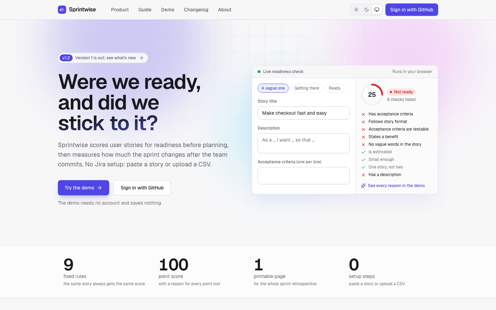
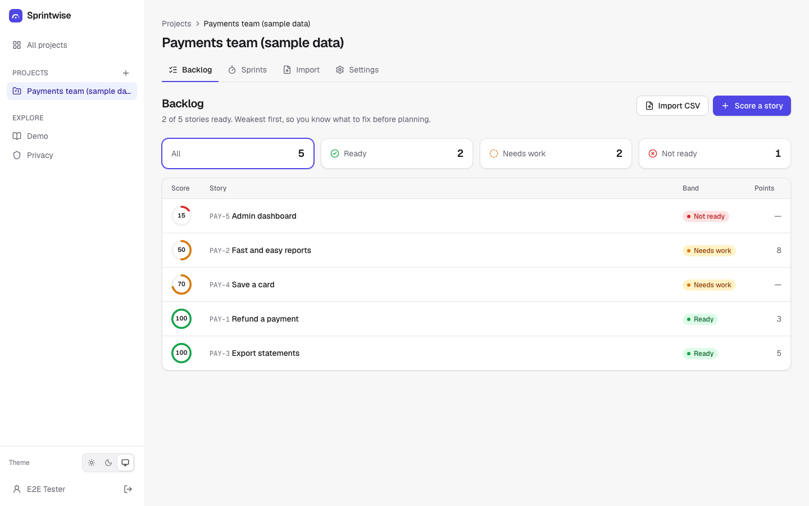
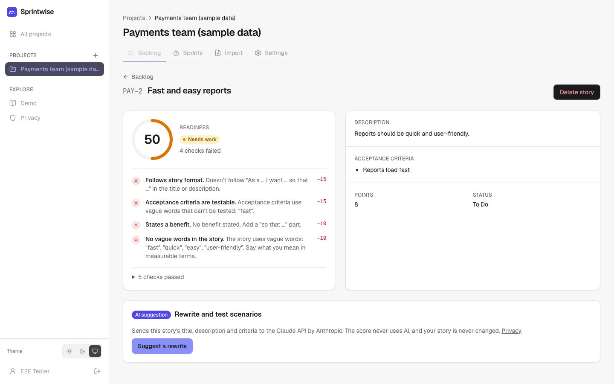
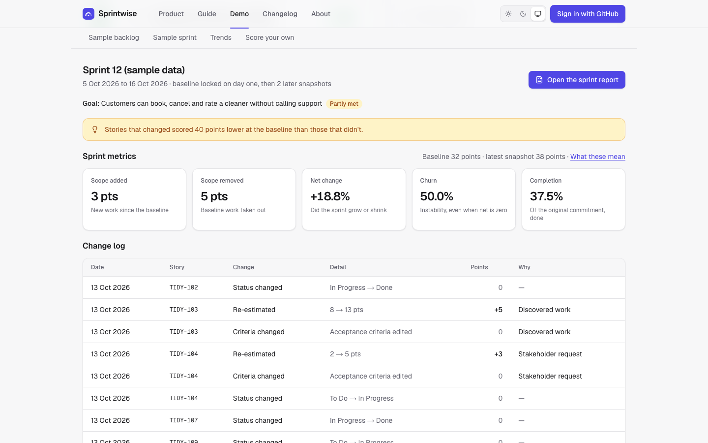
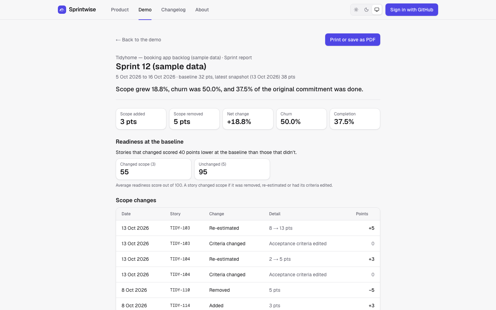

# Sprintwise

Teams often start sprints with vague stories, and mid-sprint scope changes go unmeasured. Sprintwise scores every user story for readiness before planning, then measures how much the sprint changes after the team commits.

- **Readiness check:** nine fixed rules (C1–C9) give each story a score out of 100. Every point lost comes with a plain-English reason, one per missing thing. A story that isn't estimated, or is too big, can't be Ready. The score never uses AI.
- **Scope tracking:** lock the day-one sprint as a baseline and see scope added, removed, net change, churn and completion. A sprint built from the backlog records status and points changes as they're made; a sprint kept with Jira CSVs takes a fresh export as a snapshot.

No Jira setup in v1: paste a story or upload a CSV. Light and dark themes. All sample data is invented.

**Live:** <https://sprintwise-omega.vercel.app> · try the [demo](https://sprintwise-omega.vercel.app/demo) without signing in · watch the [2-minute demo video with voice-over](https://sprintwise-omega.vercel.app/#video) on the home page.

## Status

**Version 1 is done** (v1.0) and deployed. See the requirements doc for the backlog and the build plan.

| Phase | Stories | State |
| --- | --- | --- |
| 1 · Foundations | F-1 CI, F-3 GitHub sign-in, F-4 projects | Done, live |
| 2 · Readiness rules | R-1 paste a story, R-2 CSV import, R-3 sorted backlog, R-6 rule settings | Done, live |
| 3 · AI layer | R-4 rewrites, R-5 test scenarios | Built and tested, switched off on the live site; moved to v2 (see below) |
| 4 · Scope tracking | S-1 to S-4, S-6 | Done, live |
| 5 · Report and polish | S-5, F-2 demo, L-2 accessibility, F-5 privacy | S-5 done; F-2 demo with sample sprint built; F-5 waits for the AI notice; L-2 ongoing |
| 6 · Launch | L-1, L-3 | Done: README, screenshots, demo video and usage counts |

## Screenshots

All data shown is invented. The images follow your GitHub theme. Regenerate them with `pnpm screenshots`.

<picture>
  <source media="(prefers-color-scheme: dark)" srcset="docs/screenshots/landing-dark.png">
  
</picture>

**Backlog**: every story scored and sorted weakest first, with band filters.

<picture>
  <source media="(prefers-color-scheme: dark)" srcset="docs/screenshots/backlog-dark.png">
  
</picture>

**Story**: the score and a plain-English reason for every point lost.

<picture>
  <source media="(prefers-color-scheme: dark)" srcset="docs/screenshots/story-dark.png">
  
</picture>

**Sprint**: metrics against the locked baseline, and the dated change log.

<picture>
  <source media="(prefers-color-scheme: dark)" srcset="docs/screenshots/demo-sprint-dark.png">
  
</picture>

**Report**: one printable A4 page.

<picture>
  <source media="(prefers-color-scheme: dark)" srcset="docs/screenshots/sprint-report-dark.png">
  
</picture>

## Product decisions

The calls that shaped v1, with the reasoning in [DECISIONS.md](DECISIONS.md):

- **CSV in v1, Jira in v2.** Jira's sign-in and API setup is where side projects stall. CSV import proves both halves of the product with no integration risk.
- **Rules set the score; AI never does.** A rule-based score is the same for the same story every time, and every point lost has one reason you can explain.
- **AI rewrites were built, tested, then switched off.** Suggestions cost about two US cents each on the Claude API. For a portfolio site, I kept the code and tests and moved the live feature to v2, rather than pay ongoing costs or show a half-working button. Setting `ANTHROPIC_API_KEY` turns it on.
- **An unestimated or oversized story can't be Ready.** Under the first version of the rules, a story with no estimate scored 80 and passed. The fix caps the band rather than changing the score, so every point lost still has exactly one reason.
- **The baseline can't be edited.** If it could, every scope metric would be meaningless. A baseline locked by mistake can be undone until the first later snapshot is saved; after that, the only way to redo it is to delete the sprint.
- **Built around a PO's week.** Plan with the team's real velocity and a warning before committing unready stories; tag why scope changed; share the report with stakeholders by link; watch trends across sprints. All rule-based, no AI and no running costs.
- **Rules v3: harder to fool.** A story with the right shape but vague content ("As a user … so that I can see stuff", "Then it works") scored 95 under v2. v3 asks for a named user, more criteria for bigger stories, and more vague words. A rule that fails only because another did is folded into that one's reason, so seven failed checks on a bare story read as four things to fix.
- **Team checks cap the band, not the score.** A team's own Definition of Ready items are pass/fail. Adding points would break "100 points from nine rules", so a failed check keeps a story from being Ready instead, like an oversized story does.
- **Changes are recorded as they happen.** In a sprint built from the backlog, editing a story's status or points (from the backlog, the sprint page or the story) updates that day's automatic snapshot. One automatic snapshot per day keeps the change log readable, and editing back to the old value removes it. Snapshots saved by hand are never rewritten.
- **No Jira? No CSV needed.** Stories can be typed in and edited with a live score, and a sprint's baseline and snapshots can be picked straight from the backlog. CSV stays for teams that export from Jira.

## Tech stack

- Next.js 16 (App Router) and TypeScript
- Tailwind CSS 4
- PostgreSQL through Prisma 7
- Better Auth with GitHub sign-in
- Claude API (Anthropic SDK) for optional AI suggestions, off unless a key is set
- Papa Parse and Zod for CSV parsing and validation
- Vitest, Playwright and axe for tests
- Vercel and GitHub Actions for hosting and CI

Why each choice was made is in [DECISIONS.md](DECISIONS.md).

## Run it locally

You need Node 24 (`nvm use`), pnpm and Docker.

1. Install the dependencies:

   ```bash
   pnpm install
   ```

2. Create `.env` from the example:

   ```bash
   cp .env.example .env
   ```

   In `.env`, set `BETTER_AUTH_SECRET` to the output of `openssl rand -base64 32`.

3. Start Postgres and run the migrations:

   ```bash
   pnpm db:up
   pnpm db:migrate
   ```

4. Start the app:

   ```bash
   pnpm dev
   ```

Then open <http://localhost:3000>. The demo at `/demo` works without signing in.

### GitHub sign-in

1. Create an OAuth app at <https://github.com/settings/developers>.
2. Set the callback URL to `http://localhost:3000/api/auth/callback/github`.
3. Put its client ID and secret into `GITHUB_CLIENT_ID` and `GITHUB_CLIENT_SECRET` in `.env`.

## Tests

| Command | What it covers |
| --- | --- |
| `pnpm test` | Unit tests: every scoring rule, the CSV parser, snapshot comparison and every metric, including the requirements doc's worked example |
| `pnpm test:e2e` | End-to-end tests against a production build: home page, demo, sign-in, projects, scoring, CSV import, access control, keyboard-only flows, and axe accessibility scans of every public page |
| `pnpm lint` and `pnpm typecheck` | Static checks |

CI runs all of these on every push and pull request (`.github/workflows/ci.yml`).

## Project layout

| Path | Contents |
| --- | --- |
| `src/lib/readiness` | The rules engine: pure functions, no I/O |
| `src/lib/csv` | The frozen CSV template and parser |
| `src/lib/sprint` | Snapshot comparison and sprint metrics: pure functions |
| `src/lib/server` | Database client, auth, and the data access layer that checks ownership on every read and write |
| `src/app` | Pages and server actions; `(marketing)` holds the public site: home, product, demo, changelog, about and privacy |
| `src/components/marketing` | The home page's interactive parts: live scorer, feature tabs, video player, scroll reveals |
| `src/demo` | Invented sample data for demo mode, and the demo video's captions (`video-lines.json`), shared by the recorder and the home page transcript |
| `e2e` | Playwright tests |

## Launch kit

| Document | Contents |
| --- | --- |
| [Demo video script](docs/demo-video-script.md) | A timed shot list; `pnpm record-demo --voice` records it from the live site with a voice-over ([MP4](https://github.com/NaderAbsy/sprintwise/releases/download/v0.6/sprintwise-demo.mp4), [WebM](https://github.com/NaderAbsy/sprintwise/releases/download/v0.6/sprintwise-demo.webm)) |
| [DECISIONS.md](DECISIONS.md) | Every decision with its options and reasons |

**Usage counts (L-3):** `pnpm usage` prints anonymous event counts by month: checks run, imports, reports and AI suggestions. Point it at production with `DATABASE_URL="<Neon connection string>" pnpm usage`. The events table holds only an event type and a time: no user ids and no story text.

## Security

Report security problems privately through [GitHub's vulnerability reporting](https://github.com/NaderAbsy/sprintwise/security/advisories/new), not in a public issue. [SECURITY.md](SECURITY.md) covers scope, response times and safe testing. The live site also serves [`/.well-known/security.txt`](https://sprintwise-omega.vercel.app/.well-known/security.txt).

## Known limits in v1

- CSV snapshots can't show who made a change, only between which two snapshots it happened. Who changed what arrives with the Jira integration in v2.
